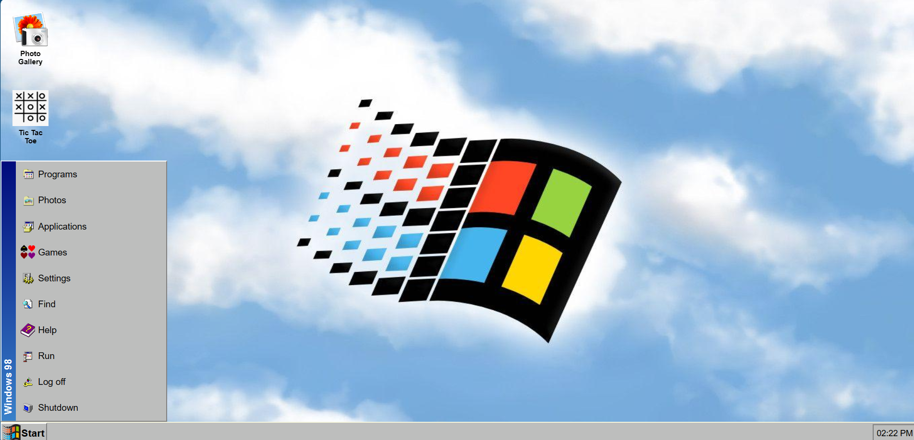
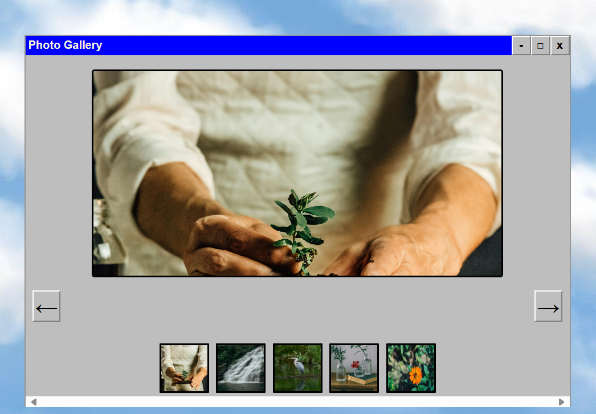
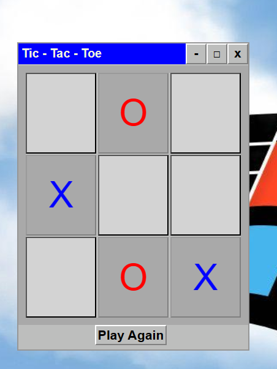
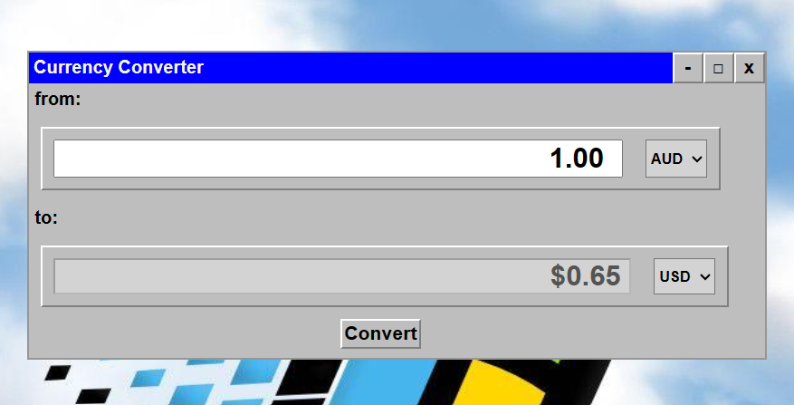

# Fake - OS

Fake OS Project in Vanilla JavaScript, SASS and HTML

## Project Description

The goal of this project is to simulate a fake operating system with layout and content built in CSS and HTML and add interactive elements using JavaScript.

## Project Requirements

- SPA (Single Page Application)
- Desktop has a wallpaper that fits the viewport
- Selectable icons
  that will open an "app", creating a modal to display some content
- Able to close an app
- Selectable start menu
- Selecting the menu will display a list of text and icons
- Clock that displays the current time
- Wallpaper scales to fit the viewport
- Minimum 3 icons on desktop
- The menu is positioned in the appropriate place (bottom left on windows, top of the screen on android)
- Apps should be able to contain text, an image or a form

## Implementation Details:

### Design:

Implemented a single page application that simulated Windows 98. It works for landscape orientation.

### Tools Used:

- HTML
- SCSS
- JavaScript

### Code Structure:

HTML, SCSS, compiled CSS, JavaScript and Image files (assets) are maintained in separate folders.

### Styling:

- The background image is Windows 98 wallpaper that fits the whole viewport at all orientations. It has z-index value equal to -2 (the lowest) to make sure the wallpaper always appears in the background.
- Start Menu button is on the bottom left of the page.
- A running clock that displays time and updates time is on the bottom right corner.
- Desktop icons are towards to top left part of the desktop.
- The taskbar is at the bottom of the desktop. It displays app names when they are minimised.
- All the design and styling of the icons, start menu, buttons, clock and apps is done in SASS and is focused to copy the windowns 98 styling as much as possible.
- Desktop apps open up usually around the centre area of the desktop.
- Each app has a menubar with close, maximise and minimise buttons.
- Each app has a consistent color scheme.

### Features

Fake - OS is built with the following features.

#### Start Menu

The "Start" button opens up a start menu on "click" event. The structure of the start menu with icons and labels is built in html but the visibililty is controlled through JavaScript by toggling the class list of the start menu.

#### Clock

The clock is made active in real time by getting the latest time each second using the setInterval function and updating the clock display.

#### Desktop Icons

The desktop icons are all linked to event listeners in JavaScript to open up their respective apps. Whenever an icon is double-clicked, JavaScript creates the respective modal and displays it to the user.

#### Apps

All the apps are actually modals that are built in JavaScript on the fly and displayed to the user. Only one instance of the app is open at a time.

##### App Menubar

All the apps have a menubar at the top with min/max, close, minimise to taskbar buttons.

- The close button closes/exits the app. This is done by removing the app from the html node tree through javascript.
- The min/max button makes the app toggle between full screen or standard size. This is achieved through CSS styling class and JavaScript.
- The minimise to taskbar button makes the app invisible and a tab is added to the taskbar which when clicked makes the app appear again. This achieved by adding tabs to DOM and changing the CSS display properties of the modal through JavaScript .

#### Gallery

The gallery app displays an image from a gallery one at time. The forward button and backward button has attached event listeners that control which photo to display and which ones to hide.

#### Tic-Tac-Toe

This is a simple tic-tac-toe game. It has a "play again" button that resets the app to the starting state.

#### Currency Converter

This app uses api calls to get latest currency exchange data and displays it to the user.

#### Other Interesting Features

- All the app windows are **draggable**. This is achieved through mouse event listeners linked to the menu bar of app window. The "mousedown", "mousemove" and "mouseup" events are used to follow the mouse movement and move the app window to a new position.
- Among Start Menu icons and tabs, clicking photo tab actually opens up the Photo Gallery app.
- The fake operating system tries to simulate the active window effect. The app window that is clicked becomes active and is displayed on top of other windows. Even the start menu opens up on top of a window if it is the one clicked most recently.
- Start menu closes when either start button is clicked or any other part of the desktop is clicked.

## Future Direction

1. The dragging functionality is not as smooth as expected. Strategy needs to be re-examined.
2. Start Menu tabs like applications should open sub-menu which selectable links.
